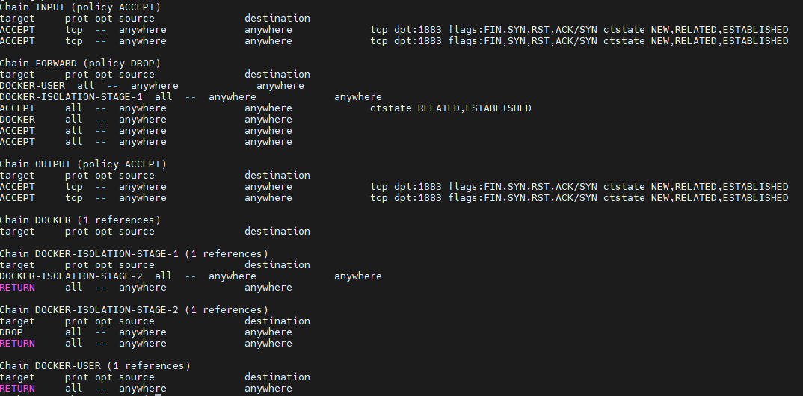
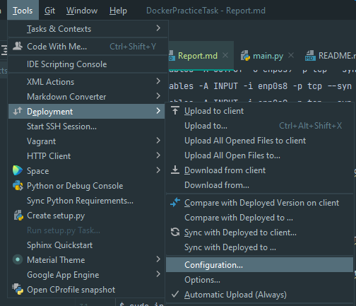
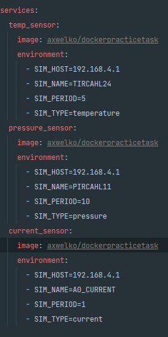
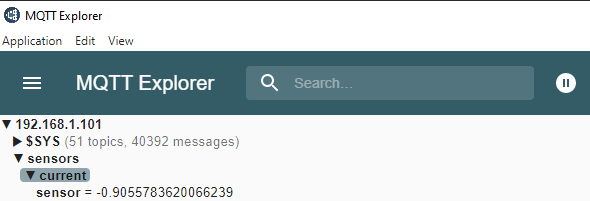
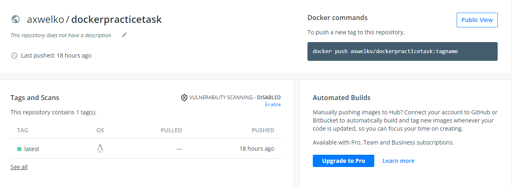
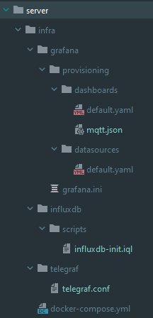
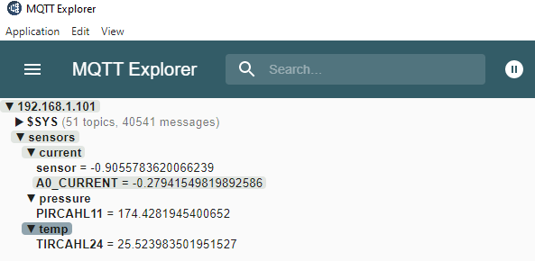
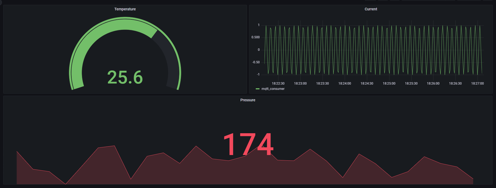
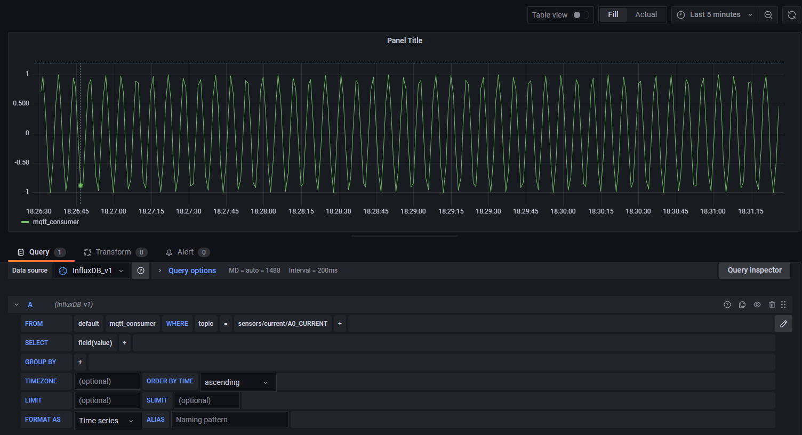

# Практическая работа работа № 2

Развернутая в данной работе схема представлена на рисунке ниже:


Симуляторы сенсоров, развернутые в докер контейнерах, публикуют сообщения на Mqtt брокер. Сервис Consumer подписывается на все сообщение, опубликованные в брокере, и заносит их в базу данных временных рядов. Сервис dashboard отображает графики полученных данных от сервисов.

## Ход выполнения работы:
1. Использую 3 VM из предыдущей практической работы.
 * установил docker на все VM по следующей инструкции: https://docs.docker.com/engine/install/ubuntu/
 * Установил docker-compose через: *$ apt install docker-compose*
 * изменил таблицу iptables на следующую:
 
```html
$ sudo iptables -A OUTPUT -o enp0s8 -p tcp --syn --dport 1883 -m conntrack --ctstate NEW,ESTABLISHED,RELATED -j ACCEPT
$ sudo iptables -A OUTPUT -o enp0s9 -p tcp --syn --dport 1883 -m conntrack --ctstate NEW,ESTABLISHED,RELATED -j ACCEPT
$ sudo iptables -A INPUT -i enp0s8 -p tcp --syn --dport 1883 -m conntrack --ctstate NEW,ESTABLISHED,RELATED -j ACCEPT
$ sudo iptables -A INPUT -i enp0s9 -p tcp --syn --dport 1883 -m conntrack --ctstate NEW,ESTABLISHED,RELATED -j ACCEPT
```


На скриншоте выше показана таблица маршрутизации на шлюзе, в которую добавлены как наши правила, так и правила, созданные контейнерами.

Зачем изменял таблицу:

* Чтобы сделать фаервол, которые отсеивает пакеты вне 1883 порта (не скажу, что у меня не осталось вопросов по этому действию).

Для того чтобы на клиенте и сервере появился интернет, прописал команду ниже, т.к. netplan по умолчанию ставит ip приватной сети:
```html
$ sudo ip route del default 
```

Теперь по порядку для каждой машины:

## Клиент (Ubuntu_A)

1. Включил "deployment to client" в Pycharm Pro, что позволило мне загружать изменения файлов на виртуальную машину автоматически;
2. Данные действия представлены на рисунках ниже:




* Указал ssh конфигурацию в виде username@внешний_ip, указал пароль для подключения к серверу, нажал *test connection*;
* Поставил галочку для "automatic upload (Always)".

3. Каким образом файлы попадают внутрь виртуальной машины:


* entity -- прописаны классы датчиков (класс Sensor и его наследники), их конструкторы и методы, чтобы работать с ними в main.py скрипте;
* main.py -- скрипт для интеграции внутрь контейнера, с помощью которого будет происходить симуляция вывод значений с датчиков; 
* Dockerfile -- порядок билда image (как будет создаваться image по слоям);
* requirments.txt -- классический файл, показывает какие python библиотеки - зависимости нужно докачать, чтобы контейнер запускался нормально;
* docker-compose.yaml -- как правило указываются различные сервисы для *docker-compose run*, в нашем случае указали имеющиеся в системе датчики.

К слову, какие вообще есть датчики:
1) Температуры;
2) Тока;
3) Давления.

Важные уточнения:

а) В *main.py* указал порт, который слушает mqtt-брокер:


б) в *docker-compose.yaml* в качестве параметра *SIM_HOST* указываю ip шлюза внутренней подсети со стороны клиента:



4. Билдим image:

```html
$ docker build -t axwelko/dockerpracticetask .
```
--------------------------------------------------------------------
Чтобы пользоваться docker без sudo, сделаем следующее:
```html
$ sudo gpasswd -a $USER docker -> добавили юзера в группу докера
$ newgrp docker -> обновить группы user'а без relogin в системе (теперь все четко)
```
--------------------------------------------------------------------

5. Запустил container на основе этого image:

Выведем в mqtt-explorer значения датчика температуры (они меняются со временем):
```html
$ docker run -e SIM_HOST=192.168.4.1 -e SIM_TYPE=temperature --rm --name current axwelko/dockerpracticetask
```



6. Запушим image в docker-hub, перед этим залогинимся в консоли в сам docker hub:

```html
$ docker push axwelko/dockerpracticetask
```



## Шлюз (Ubuntu_B)

1. Задеплоим на шлюз содержимое папки *gateway*, т.е. mqtt конфиг-файл:

```html
listener 1883 # слушаем данный порт
allow_anonymous true # разрешаем коннект к данному шлюзу без ввода л/п (т.е. в анонимном режиме) 
```

2. Развернул mosquitto брокер с помощью docker. Настроил проброс портов, необходимый для работы приложения:

```html
$docker run -v $PWD/mosquitto:/mosquitto/config -p 1883:1883 --name broker --rm eclipse-mosquitto
```

```html
-v $PWD/mosquitto:/mosquitto/config # с помощью ссылки передаю файл в контейнер
```
При изменении файла на гостевой ОС он будет также меняться и внутри контейнера.

3. При запуске контейнера будет обновляться информация в MQTT Explorer, о чем я говорил и показывал на скриншоте ранее.

## Сервер (Ubuntu_C)

1. Деплою следующие файлы на сервер:



2. Делаю следующую конфигурацию *mosquitto.conf*:

```html
CREATE database sensors
USE sensors
CREATE USER telegraf WITH PASSWORD 'telegraf' WITH ALL PRIVILEGES
```

3. Также меняю элементы *telegraf.conf*:

```html
# блок mqtt_consumer
servers = ["tcp://192.168.6.1:1883"] # адрес vm с mqtt-брокером (настраиваю подписку телеграфа на mqtt топики брокера)
topics = [
  "sensors/#"
]
data_format = "value"
data_type = "float"

# блок outputs.influxdb
urls = ["http://influxdb:8086"] # адрес докера с influxdb (указал alias при docker-compose)
database = "sensors"
skip_database_creation = true
username = "telegraf"
password = "telegraf"
```

------------------------------------------------------------------------------------
Пояснения:
1. Удалить все контейнеры, запущенные через docker-compose:

```html
$ sudo docker rm -f $(sudo docker ps -a -q)
```

2. Удалить все именованные тома, запущенные через docker-compose:

```html
$ sudo docker volume rm $(sudo docker volume ps -q)
```

3. Остановить docker-compose:

```html
$ sudo docker-compose down
```
------------------------------------------------------------------------------------

## Запуск docker-compose:
1. На клиенте и сервере:

```html
$sudo docker-compose up -d
```
2. На шлюзе:

```html
$docker run -v $PWD/mosquitto:/mosquitto/config -p 1883:1883 --name broker --rm eclipse-mosquitto
```

3. Что видим в MQTT Explorer:



4. Что видим в grafana's dashboard:



Как попал в grafana и что делал:
* Перешел по адресу внешний_ip_сервера:3000;
* л/п: admin/admin;
* Add panel ->  add a new panel -> произвел настройки -> apply;
* Далее действовал согласно сриншоту ниже:



Пример для датчика тока.

5. Сохранил json-файл локально в */vms/server/infra/grafana/provisioning/dashboards/mqtt.json*